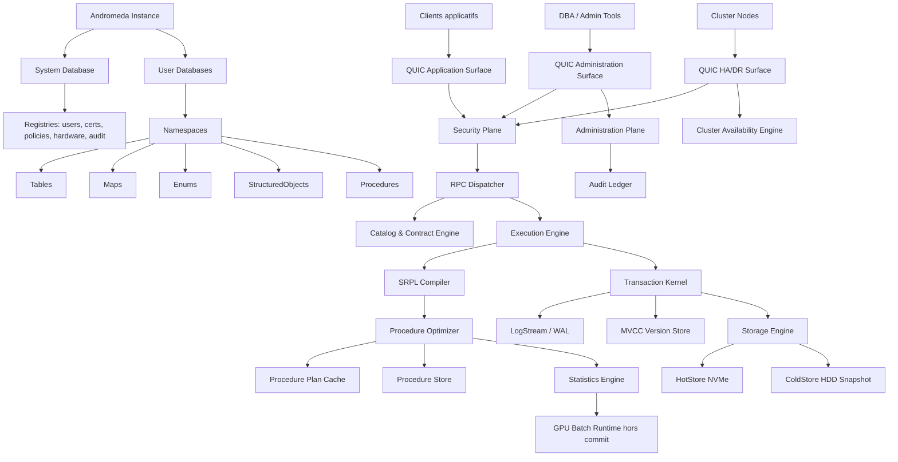

# 00 — Index consolidé et mode de compréhension du projet

> Consolidation : **Andromeda — SGBDRT Moderne 2026**  
> Date : **2026-05-06**  
> Nature : **Markdown final consolidé**  
> Sources intégrées : 18 fichiers Markdown V0, 1 complément Storage Engine, 3 PDF de fondation.  
> Doctrine : relationnel transactionnel, RPC-only, SRPL, typage fort, déterminisme, observabilité, recovery, Enterprise Grade.


## 1. Objet de cette consolidation

Ce fichier ouvre la nouvelle documentation consolidée du projet **Andromeda**. Il sert de point d’entrée, de table d’orientation, de carte de lecture et de manifeste conceptuel. Les cinq autres fichiers Markdown sont volontairement plus denses : ils remplacent le morcellement initial en documents plus cohérents, en conservant les décisions structurantes du projet.

Le but n’est pas de produire une documentation marketing. Le but est de construire une base de travail exploitable pour un **SGBDRT moderne 2026**, c’est-à-dire un système de gestion de base de données relationnel transactionnel, strict, contractuel, déterministe autant que possible, observable et récupérable après panne.

Andromeda se place dans une ligne claire : conserver la solidité du relationnel, des transactions, de WAL/MVCC/recovery, de l’optimisation à coût, des statistiques et des catalogues versionnés, mais refuser la surface SQL ad hoc comme surface applicative native. La surface native d’Andromeda est une surface de procédures RPC strictement contractuelles.

```text
Client applicatif
  -> QUIC Application Surface
  -> RPC custom typé
  -> Procedure cataloguée
  -> SRPL compilé/validé
  -> TransactionScope implicite
  -> WAL durable
  -> Commit visible
  -> ResultStream typé
```

## 2. Composition finale de l’archive

La racine de l’archive contient exactement les **six Markdown finaux** :

| Ordre | Fichier final | Rôle |
|---:|---|---|
| 00 | `00_ANDROMEDA_INDEX_ET_MODE_DE_LECTURE.md` | Point d’entrée, carte de lecture, doctrine compacte, matrice de traçabilité. |
| 01 | `01_DOCTRINE_LEXIQUE_ARCHITECTURE_CATALOGUE_MODELIZATION.md` | Vision, invariants, lexique natif, architecture globale, catalogue, Modelization et DefinitionBatch. |
| 02 | `02_TYPE_SYSTEM_SRPL_PROCEDURES_MAPS.md` | Type System, Tables, Enums, StructuredObjects, SRPL, procédures, contrats, Maps et règles de cohérence. |
| 03 | `03_TRANSACTION_WAL_MVCC_STORAGE_RECOVERY.md` | Transaction Kernel, WAL, MVCC, recovery, storage hot/cold, formats binaires, segments et invariants de contiguïté. |
| 04 | `04_QUIC_RPC_SECURITY_HADR_OPERATIONS.md` | QUIC, RPC custom, contrats réseau, sécurité, IAM, audit, administration, HA/DR, backup, restore et forensic. |
| 05 | `05_OPTIMIZER_STATS_ANALYTICS_HARDWARE_ROADMAP_SOURCES.md` | Procedure Store, optimiseur, statistiques, evidence prédictive, analytique, hardware, Rust, roadmap, risques et sources. |

L’archive conserve aussi les **trois PDF originaux** dans `sources_originales/pdf/`, conformément à la consigne de les garder comme références. Les Markdown sources initiaux sont également placés dans `sources_originales/markdown/` pour traçabilité, mais les documents de travail à utiliser sont les six fichiers finaux en racine.

## 3. Résumé doctrinal en une page

Andromeda est un moteur relationnel transactionnel où le comportement applicatif passe exclusivement par des **Procedure** cataloguées. Une Procedure possède un contrat typé, un `ContractHash`, une version de catalogue, une version de statistiques, une politique de permissions, une trace d’invocation et un périmètre transactionnel implicite. Le client ne pousse pas de SQL texte ad hoc au moteur.

La doctrine centrale est :

```text
Strict aux frontières.
Adaptatif à l’intérieur.
```

Les frontières strictes sont : types, contrats, procédures, transactions, sécurité, stockage durable, protocole réseau, catalogue, import, audit, permissions, recovery et versions. Les zones adaptatives sont : choix de plan, spécialisation de plan, batch size, layout row/column, cache, usage CPU/SIMD, usage GPU hors commit path, statistiques, evidence prédictive et politiques de ressources.

Toute adaptation doit être :

| Propriété | Exigence |
|---|---|
| Versionnée | Reliée à `CatalogVersion`, `StatsVersion`, `PolicyVersion`, `ContractHash` ou équivalent. |
| Observable | Mesurable par traces, métriques, compteurs ou journaux d’audit. |
| Bornée | Soumise à des quotas, classes, limites ou garde-fous. |
| Désactivable | Retirable sans casser le noyau transactionnel ni la cohérence. |
| Explicable | Justifiable après coup par une `DecisionTrace` ou trace équivalente. |

## 4. Invariants non négociables

Ces invariants constituent le socle de conception. Une fonctionnalité qui les viole doit être rejetée, isolée ou repoussée hors du noyau.

```text
1. Pas de SQL ad hoc en surface applicative.
2. Toute exécution applicative passe par une Procedure cataloguée.
3. Toute Procedure possède un contrat typé, hashé et versionné.
4. Toute Procedure est transactionnelle implicitement.
5. Aucun commit visible sans WAL durable.
6. La RAM n’est jamais la vérité système.
7. Vérité = dernier snapshot froid valide + WAL durable depuis ce snapshot.
8. Le GPU ne participe jamais au commit path.
9. Le benchmark prédictif ne décide jamais seul.
10. Les statistiques actives sont toujours versionnées.
11. Les plans actifs sont liés à CatalogVersion + StatsVersion + ContractHash.
12. Les Maps sont matérialisées ; les Views virtuelles génériques ne sont pas natives.
13. Les Enum sont des types catalogués, pas des tables cachées.
14. Les StructuredObjects sont toujours typés, même génériques.
15. La Modelization est externe au runtime ; elle devient réelle par import validé.
16. Tout changement de catalogue est batché, ordonné, validé, journalisé et audité.
17. Toute optimisation non observable est rejetée.
18. Toute fonctionnalité non récupérable après crash est rejetée.
19. Toute sortie réseau/fichier depuis une Procedure est interdite.
20. Toute décision critique doit pouvoir être expliquée après coup.
```

## 5. Carte logique du système



## 6. Lecture recommandée

### Lecture rapide

Lire d’abord ce fichier, puis :

1. `01` pour comprendre la doctrine, le vocabulaire et les objets.
2. `02` pour comprendre ce que le développeur écrit réellement : types, procédures, contrats, Maps.
3. `03` pour comprendre pourquoi un commit est fiable et comment l’état est reconstruit.
4. `04` pour comprendre comment les clients, administrateurs et nœuds cluster interagissent avec le moteur.
5. `05` pour comprendre comment le moteur devient performant sans devenir imprévisible.

### Lecture d’architecture

Commencer par `01`, puis `03`, puis `04`. Ce chemin cible la séparation des moteurs, le catalogue, la transaction, le stockage et la sécurité.

### Lecture langage

Commencer par `02`, puis `01`, puis `05`. Ce chemin cible SRPL, les types, les contrats, la compilation, le plan cache et l’optimisation.

### Lecture implémentation Rust / moteur

Commencer par `03`, puis `05`, puis `04`. Ce chemin cible WAL, pages, segments, unsafe Rust, profils CPU, I/O, QUIC, backpressure et recovery.

## 7. Matrice de traçabilité des sources

| Source initiale | Consolidation principale | Contenu intégré |
|---|---|---|
| `00.Index.md` | `00` | Intention V0, diagramme global, règle de lecture. |
| `01.Vision_Doctrine_Invariants.md` | `00`, `01` | Doctrine, invariants, critères d’acceptation, criticité. |
| `02.Lexique_Andromeda_SQL_Equivalences.md` | `01` | Lexique natif, équivalences SQL contrôlées, termes bannis. |
| `03.Architecture_Globale_Modules.md` | `01` | Moteurs fonctionnels, plans transverses, interdictions de dépendance. |
| `04.Catalogue_Bases_Namespaces_Objets.md` | `01`, `02` | System Database, Database, Namespace, Table, Map, Enum, StructuredObject, Procedure. |
| `05.SRPL_Langage_Procedures.md` | `02` | SRPL, procédures, transaction implicite, erreurs, mutations, compilation. |
| `06.Type_System_Tables_Enums_StructuredObjects.md` | `02` | Types numériques, decimal/float, bool, texte, nullabilité, Enum flags, StructuredObject. |
| `07.Maps_Analytique_Temps_Reel.md` | `02`, `05` | Maps matérialisées, cohérence, refresh, analytics. |
| `08.Transaction_Kernel_WAL_MVCC_Recovery.md` | `03` | États transactionnels, WAL, MVCC, GC, recovery, cas critiques. |
| `09.Storage_Engine_HotCold_BinaryFormats.md` | `03` | RAM/NVMe/HDD, pages, extents, manifest, snapshot, I/O Scheduler. |
| `10.Network_QUIC_RPC_Contracts.md` | `04` | QUIC, RPC, frames, metadata, structured payload, fast/slow path, backpressure. |
| `11.Procedure_Store_Optimizer_Stats_Benchmark.md` | `05` | Procedure Store, Optimizer, Statistics, Predictive Evidence, ScenarioEvidence. |
| `12.Security_IAM_Admin_Audit.md` | `04` | mTLS, CertificateIdentity, UserPrincipal, permissions, admin, debug, audit. |
| `13.HADR_Backup_Restore_Forensic.md` | `04` | Single Primary, replicas, quorum, failover, WAL shipping, PITR, ForensicStart. |
| `14.Hardware_Rust_CPU_GPU_NVMe.md` | `05` | Rust, unsafe, CPU x64/ARM64, GPU, NVMe/ZNS, HDD. |
| `15.Modelization_Import_Batch_Catalog_Evolution.md` | `01` | Modelization externe, DefinitionBatch, DryRun, import transactionnel. |
| `16.Roadmap_V0_Risques_Decisions.md` | `05` | Phases V0, priorités, risques, décisions ouvertes. |
| `17.Sources_References.md` | `05` | Références : Codd, ARIES, Volcano, column stores, QUIC, WAL, Rust, ZNS, CPU/GPU. |
| `Andromeda_Storage_Engine.md` | `03` | Segments, contiguïté, append-only, cold immutability, compression par bloc. |
| `Rapport consolidé...pdf` | `05`, `03`, `01` | Socle scientifique : relationnel, ACID concret, isolation, normalisation, indexation, learned components prudents. |
| `Corpus de référence...pdf` | `05` | Bibliographie raisonnée : consensus durable vs front moderne 2024-2026. |
| `Fondation de SRPL...pdf` | `02` | Justification SRPL : langage relationnel procédural strict, set semantics, absence explicite, cardinalité, IR. |

## 8. Lexique minimal de lecture

| Terme Andromeda | Sens natif | Équivalent pédagogique possible |
|---|---|---|
| Instance | Processus/moteur Andromeda et surfaces associées. | Instance serveur. |
| System Database | Base système maître : catalogues globaux, utilisateurs, certificats, policies, audit. | master/system catalog. |
| Database | Base utilisateur isolée. | Database. |
| Namespace | Espace de nommage logique. | Schema. |
| Table | Relation stockée typée. | Table. |
| Map | Projection matérialisée versionnée et stockée. | Materialized View. |
| Enum | Type nommé catalogué, avec mode flags possible. | Enum / table de référence simulée. |
| StructuredObject | Shape tabulaire typé en entrée/sortie. | TVP / record tabulaire. |
| Procedure | Unité comportementale transactionnelle, seule surface d’exécution applicative. | Stored Procedure. |
| ContractHash | Empreinte canonique du contrat. | Signature/hash schema+proc. |
| CatalogVersion | Version publiée du catalogue. | Schema version. |
| StatsVersion | Version publiée des statistiques. | Statistics version. |
| Procedure Store | Historique réel des invocations et plans. | Query Store conceptuel. |
| ResultStream | Flux de résultat typé et métadonné. | Result set. |
| DefinitionBatch | Lot ordonné de définitions importées. | Migration batch. |

Règle documentaire : le terme Andromeda est prioritaire. L’équivalence SQL n’est qu’un repère pédagogique.

## 9. Ce qu’Andromeda refuse explicitement

| Refus | Raison |
|---|---|
| SQL ad hoc applicatif | Non borné, difficile à contractualiser, sécurité et observabilité plus fragiles. |
| Procedure qui accède au réseau externe | Rupture du déterminisme et du recovery. |
| Procedure qui accède au filesystem externe | Rupture du périmètre transactionnel et de l’audit. |
| GPU dans le commit path | Non nécessaire et dangereux pour la durabilité déterministe. |
| Benchmark prédictif décisionnaire | Risque de pseudo-vérité statistique. |
| View virtuelle générique native | Ambiguïté de coût et de cohérence ; Andromeda privilégie les Maps matérialisées. |
| NULL ambiant | Logique ternaire et ambiguïtés ; préférer absence typée/explicite. |
| Boucle non bornée en SRPL noyau | Non optimisable, risque de non-terminaison, coût imprévisible. |
| Conversion implicite dangereuse | Erreurs silencieuses, incohérence de contrats. |
| Optimisation non observable | Impossible à diagnostiquer et à gouverner. |

## 10. Critères d’acceptation d’une fonctionnalité

Une fonctionnalité candidate doit répondre positivement aux questions suivantes :

| Critère | Question | Décision si échec |
|---|---|---|
| Définissabilité | Peut-on la définir formellement ? | Rejet ou recherche. |
| Déterminisme | Même entrée + même état + mêmes versions => même résultat ? | Rejet ou sandbox. |
| Typage | Peut-elle être typée avant exécution ? | Rejet du noyau. |
| Bornage | Peut-on limiter son espace d’exécution ? | Rejet du noyau. |
| Observabilité | Peut-on mesurer son effet ? | Rejet. |
| Recovery | Peut-on rejouer/récupérer après crash ? | Rejet. |
| Sécurité | Peut-elle contourner les permissions ? | Rejet. |
| Versioning | Peut-on l’attacher à une version ? | Rejet. |
| Explicabilité | Peut-on expliquer sa décision après coup ? | Rejet ou mode expérimental. |
| Désactivation | Peut-on la couper sans casser la cohérence ? | Rejet. |

## 11. Carte des niveaux de criticité

| Niveau | Nom | Règle de conception |
|---:|---|---|
| C0 | Expérimental isolé | Jamais dans le chemin critique. |
| C1 | Opportuniste | Désactivable sans impact de cohérence. |
| C2 | Important | Mesuré, budgeté, observable. |
| C3 | Critique | Versionné, audité, soumis à policy. |
| C4 | Mission Critical | Testé en recovery et crash scenarios. |
| C5 | Non négociable | Garanti par design, non contournable. |

Exemples : WAL durable avant commit est C5. GPU analytics est C1-C2 selon usage. Procedure Store est C3 pour diagnostic et optimisation. ForensicStart est C4. System Database est C5.

## 12. Synthèse opérationnelle

La première implémentation ne doit pas commencer par le GPU, ni par un optimiseur sophistiqué, ni par un cluster avancé. Le premier vertical slice doit prouver :

```text
Catalog minimal
+ Type System minimal
+ SRPL minimal
+ Procedure contract
+ RPC local ou QUIC minimal
+ TransactionScope
+ WAL durable
+ Commit visible
+ ResultStream typé
+ Procedure Store trace
+ Crash/recovery test
```

Tant que ce chemin n’est pas fiable, le reste est secondaire.

## 13. Position de cette consolidation

Cette consolidation rend les documents plus exploitables, mais ne prétend pas figer la syntaxe définitive de SRPL, le format binaire final, le protocole exact de quorum, le choix de PageSize, la représentation interne des Decimal, le format de ContractHash ou la stratégie de native code cache. Ces points restent des décisions ouvertes, listées dans le document `05`.

La ligne directrice reste stable : **Andromeda doit réduire l’ambiguïté plus qu’il ne doit multiplier les fonctionnalités.**


---

## Annexe locale — règle de consolidation

Cette version consolide les fichiers projet et les trois PDF de fondation sans tenter de transformer Andromeda en moteur SQL généraliste. Les équivalences SQL restent pédagogiques. La surface native reste :

```text
QUIC + RPC custom + Procedure cataloguée + SRPL + contrats typés + WAL/MVCC/recovery
```

Toute extension future doit rester définissable, déterministe ou explicitement bornée, typée, observable, récupérable après crash, versionnée, explicable et désactivable.

