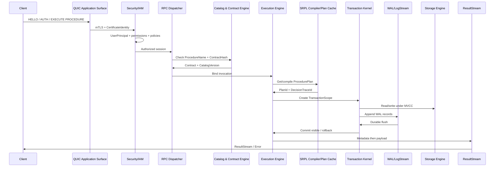

# 01 — Doctrine, lexique, architecture, catalogue et Modelization

> Consolidation : **Andromeda — SGBDRT Moderne 2026**  
> Date : **2026-05-06**  
> Nature : **Markdown final consolidé**  
> Sources intégrées : 18 fichiers Markdown V0, 1 complément Storage Engine, 3 PDF de fondation.  
> Doctrine : relationnel transactionnel, RPC-only, SRPL, typage fort, déterminisme, observabilité, recovery, Enterprise Grade.


## 1. Périmètre du document

Ce document consolide les dimensions structurantes d’Andromeda : la doctrine, le lexique, l’architecture des moteurs, les plans transverses, le catalogue canonique et le workflow de Modelization/import. Il répond à une question : **de quoi Andromeda est-il fait, quels mots utilise-t-il et quelles frontières ne doivent jamais être brouillées ?**

Le système visé n’est pas un serveur SQL généraliste avec une couche moderne autour. C’est un SGBDRT contractuel : relationnel par son modèle de données, transactionnel par ses garanties, procédural par sa surface applicative, strict par ses contrats et déterministe dans ses décisions critiques.

## 2. Positionnement d’Andromeda

Andromeda est un **Système de Gestion de Base de Données Relationnel Transactionnel**. Le mot relationnel n’est pas décoratif : les données sont modélisées par relations typées, contraintes, clés, dépendances, statistiques et plans d’exécution. Le mot transactionnel n’est pas décoratif non plus : toute modification visible doit être protégée par une transaction, couverte par le WAL et récupérable après crash.

La rupture par rapport aux SGBDR classiques ne porte pas sur les fondations scientifiques. Elle porte sur la surface d’appel :

```text
Pas de SQL ad hoc applicatif.
Pas de requête texte libre envoyée par les clients.
Pas de permissivité dynamique comme API principale.
Une seule unité comportementale : Procedure cataloguée.
```

La surface native est :

```text
QUIC + RPC custom + contrats typés + Procedure + SRPL + ResultStream typé
```

Cette surface force l’application à consommer des contrats versionnés, plutôt qu’à fabriquer au runtime des requêtes textuelles impossibles à gouverner proprement.

## 3. Doctrine : strict aux frontières, adaptatif à l’intérieur

La doctrine centrale d’Andromeda est :

```text
Strict aux frontières.
Adaptatif à l’intérieur.
```

### 3.1 Frontières strictes

Les frontières strictes sont les zones où l’ambiguïté doit être réduite au minimum :

| Frontière | Règle |
|---|---|
| Type System | Tout paramètre, colonne, StructuredObject et résultat critique est typé avant exécution. |
| Procedure Contract | Toute Procedure possède une signature, un input shape, un output shape, des permissions et un `ContractHash`. |
| Catalog | Toute définition existe dans une `CatalogVersion` publiée. |
| Transaction | Toute Procedure crée un `TransactionScope` implicite. |
| WAL | Un commit visible exige un WAL durable. |
| Network | Les clients parlent RPC contractuel, pas SQL texte libre. |
| Security | Les certificats ne donnent jamais un bypass de permissions. |
| Import | Les changements de catalogue passent par `DefinitionBatch` validé. |
| Audit | Toute opération critique produit une trace. |
| Recovery | Une fonctionnalité non récupérable après crash ne rentre pas dans le noyau. |

### 3.2 Zones adaptatives

Les zones adaptatives sont autorisées, mais elles doivent rester gouvernées :

| Zone | Adaptation possible | Garde-fou |
|---|---|---|
| Optimizer | Choix de plan, join order, access path, plan class. | DecisionTrace, quotas, hysteresis. |
| Plan Cache | Spécialisation par shape d’entrée. | PlanClass bornées, éviction, fusion. |
| Statistics | Refresh, histogrammes, skew detection. | StatsVersion candidate puis publication contrôlée. |
| Hardware | SIMD, GPU batch, NVMe scheduling. | Policy hardware, fallback CPU, jamais GPU commit. |
| Maps | Refresh immediate/incremental/deferred. | Policy explicite, budget de coût. |
| Backpressure | Réduction batch size, spool, rejet. | Quotas, audit d’abus, métriques. |

## 4. Invariants détaillés

### 4.1 Invariants de surface

1. La surface applicative ne reçoit pas de SQL ad hoc.
2. Les clients appellent une Procedure par nom qualifié et `ContractHash` compatible.
3. Une Procedure expose un contrat stable : paramètres, types, cardinalités, StructuredObjects, résultats, permissions.
4. Les metadata de résultat précèdent toujours le payload.
5. Une erreur renvoyée est typée et associée à une trace.

### 4.2 Invariants de transaction

1. Toute Procedure est transactionnelle par essence.
2. L’utilisateur n’a pas à écrire `transaction required` pour obtenir une transaction.
3. Le moteur crée `Invocation -> TransactionScope -> TxId -> MVCC visibility -> WAL coverage -> Commit/Rollback`.
4. Aucun commit ne devient visible avant flush durable du WAL.
5. Le rollback doit pouvoir être exécuté même après erreur partielle.
6. Un état `Poisoned` interdit la poursuite normale et force une sortie contrôlée.

### 4.3 Invariants de vérité

```text
État canonique = dernier Cold Snapshot valide + WAL durable depuis ce snapshot
```

Conséquences :

| Élément | Statut |
|---|---|
| RAM | Working set volatil, jamais vérité. |
| BufferPool | Cache de pages, jamais autorité durable. |
| NVMe HotStore | Vérité récente reconstructible : WAL, pages chaudes, version store. |
| HDD ColdStore | Snapshots publiés, manifests, archives, vérité froide consolidée. |
| GPU | Accélérateur analytique/statistique, jamais autorité transactionnelle. |

### 4.4 Invariants d’observabilité

Toute décision importante doit être retraçable. Les traces minimales sont :

```text
ProcedureInvocationTrace
TransactionTrace
PlanDecisionTrace
CatalogChangeTrace
DefinitionBatchApplyTrace
SecurityAuditTrace
AdminOperationTrace
RecoveryTrace
ClusterEventTrace
```

## 5. Critères d’acceptation et logique de rejet

Andromeda doit rejeter par défaut ce qui n’est pas strictement encadrable. Le tableau suivant sert de grille de décision.

| Critère | Validation attendue | Exemple de rejet |
|---|---|---|
| Définissabilité | La sémantique peut être écrite sans ambiguïté. | Fonction magique dépendante du temps système brut. |
| Déterminisme | Même entrée et même état produisent le même résultat contractuel. | Random non seedé dans une Procedure. |
| Typage | Le shape est connu avant exécution. | Record dynamique dont les colonnes changent par affectation. |
| Bornage | Coût et espace peuvent être limités. | Boucle `while` non bornée dans SRPL noyau. |
| Observabilité | Effet mesuré et traçable. | Optimisation invisible sans compteur. |
| Recovery | Rejouable ou reconstructible après panne. | Mutation hors WAL. |
| Sécurité | Soumise aux permissions et audit. | Certificat donnant accès direct à admin. |
| Versioning | Liable à une version stable. | Plan sans `CatalogVersion`. |
| Explicabilité | Décision justifiable. | Plan forcé par benchmark sans trace. |
| Désactivation | Peut être coupée sans incohérence. | Extension qui change la sémantique du commit. |

## 6. Lexique natif

Andromeda doit posséder un vocabulaire propre. Les équivalences SQL sont utiles pour transmettre, mais elles ne doivent pas piloter la conception.

### 6.1 Lexique structurel

| Terme natif | Définition | Équivalent pédagogique |
|---|---|---|
| Instance | Un moteur Andromeda actif avec ses surfaces et bases. | Instance SQL Server / serveur. |
| System Database | Base système maître : registry des bases, utilisateurs, certificats, policies, audit, catalog history. | master/system catalog. |
| Database | Base utilisateur isolée. | Database. |
| Namespace | Espace de nommage logique pour Tables, Maps, Enums, StructuredObjects, Procedures. | Schema. |
| Table | Relation persistante typée avec colonnes, contraintes, access paths, statistiques. | Table. |
| Column | Attribut typé d’une Table. | Column. |
| Row | Instance d’une relation. | Row/tuple. |
| Map | Projection matérialisée stockée, avec policy de cohérence. | Materialized View. |
| Enum | Type nommé catalogué, compact, avec mode flags possible. | Enum ou table de référence simulée. |
| StructuredObject | Shape tabulaire typé pour paramètres et résultats. | TVP / record table. |
| Procedure | Unité comportementale transactionnelle, appelée par RPC. | Stored Procedure. |
| Modelization | Artefact externe de préconception, non runtime. | Diagramme/modèle de données. |
| DefinitionBatch | Lot ordonné de définitions importées. | Migration script contrôlé. |

### 6.2 Lexique runtime

| Terme natif | Définition | Équivalent pédagogique |
|---|---|---|
| Invocation | Appel effectif d’une Procedure. | Exécution. |
| Procedure Store | Mémoire historique des invocations, plans et coûts réels. | Query Store conceptuel. |
| Procedure Plan | Plan d’exécution d’une Procedure. | Query Plan. |
| Procedure Plan Cache | Cache des plans actifs. | Plan Cache. |
| Procedure Code Cache | Cache optionnel de code compilé/natif. | Native code cache. |
| ResultStream | Flux de résultats typés et métadonnés. | Result set. |
| RowCountExact | Cardinalité exacte exposée avant payload si contractuelle. | COUNT exact metadata. |
| RowsAffected | Nombre exact de lignes mutées. | @@ROWCOUNT / affected rows. |
| ContractHash | Empreinte canonique du contrat. | Signature hash. |
| CatalogVersion | Version du catalogue publiée. | Schema version. |
| StatsVersion | Version des statistiques publiée. | Statistics version. |
| DecisionTrace | Trace explicative d’un choix moteur. | Explain + telemetry + audit. |

### 6.3 Termes à éviter

| Terme | Décision |
|---|---|
| Query | À éviter dans le discours natif ; préférer Procedure/Invocation. |
| Query Store | Remplacer par Procedure Store. |
| View | Bannir comme objet natif générique ; préférer Map. |
| Model | Éviter ; préférer Modelization. |
| Script migration | Éviter ; préférer DefinitionBatch / ApplyDefinitionBatch. |
| SQL ad hoc | Hors modèle natif ; mention comparative uniquement. |

## 7. Architecture globale

Andromeda doit éviter un **God Engine**. Le système doit être découpé en moteurs fonctionnels et plans transverses. Un moteur fonctionnel possède une responsabilité claire ; un plan transverse impose des règles vérifiables sur plusieurs moteurs sans devenir un parent global.

### 7.1 Moteurs fonctionnels

| Moteur | Responsabilité |
|---|---|
| Core Engine | I/O bas niveau, mémoire, clocks, scheduler, hardware profile, accounting. |
| Network Surface Layer | Surfaces QUIC séparées : Application, Administration, HA/DR. |
| Execution Engine | Dispatch RPC, validation contrat, binding Procedure, orchestration. |
| SRPL Compiler | Parse, AST typé, validation sémantique, IR relationnel, plan candidates. |
| Transaction Kernel | États transactionnels, MVCC visibility, commit/rollback protocol. |
| Storage Engine | WAL, pages, extents, BufferPool, HotStore, ColdStore, recovery. |
| Catalog & Contract Engine | Vérité canonique des objets, types, contrats, versions. |
| Analytics & Statistics Engine | Histogrammes, cardinalité, skew, StatsVersion, validation. |
| Predictive Evidence Engine | Scénarios contrôlés, ScenarioEvidence, scores, expiration. |
| Internal Analytical Plane | Maps, column segments, analytical snapshots, batch GPU/SIMD. |
| Security / IAM Plane | mTLS, UserPrincipal, certificats, rôles, permissions, audit. |
| Administration Plane | Jobs, maintenance, debug SRPL, backup, monitoring. |
| Cluster Availability Engine | Replication, quorum, fencing, failover, replicas. |
| Observability / Forensic Plane | Traces, métriques, evidence, recovery evidence. |

### 7.2 Plans transverses

| Plan transverse | Rôle |
|---|---|
| Durability Plane | Imposer WAL, flush, checkpoints, snapshots, manifests, recovery. |
| Security Plane | Authentifier, autoriser, auditer. |
| Resource Governance Plane | Budgets CPU/RAM/NVMe/GPU, quotas, backpressure. |
| Policy Plane | Centraliser les règles versionnées de comportement. |
| Observability Plane | Traces, métriques, forensic, décision post-mortem. |
| Contract Plane | Valider les contrats, versions et compatibilités. |

### 7.3 Interdictions de dépendance

```text
Application Surface -> Administration Plane
Application Surface -> Cluster Engine
GPU Runtime -> Commit Protocol
Predictive Evidence Engine -> Forced Plan Decision
Map Refresh -> WAL Priority Override
Procedure -> External Network
Procedure -> External Filesystem
Certificate -> Permission Bypass
Replica -> Self Promote Without Quorum
```

Ces interdictions sont plus importantes que les diagrammes : elles empêchent l’érosion progressive de la sécurité, de la durabilité et de l’explicabilité.

## 8. Flux d’invocation canonique



## 9. Catalogue canonique

Le catalogue est la vérité contractuelle du système. Il ne stocke pas seulement des noms d’objets ; il permet de reconstruire **quel objet existait, avec quel contrat, à quelle version, introduit par quel batch, sous quelle policy et par quel acteur**.

### 9.1 Hiérarchie

```text
Andromeda Instance
├── System Database
│   ├── Database Registry
│   ├── UserPrincipal Registry
│   ├── Certificate Registry
│   ├── Global Type Registry
│   ├── Engine Policy Registry
│   ├── Hardware Profiles
│   ├── Security Audit
│   └── Catalog History
└── User Databases
    ├── Namespace
    │   ├── Table
    │   ├── Map
    │   ├── Enum
    │   ├── StructuredObject
    │   └── Procedure
    ├── Procedure Store
    ├── Statistics Store
    └── Definition History
```

### 9.2 System Database

La System Database est C5. Elle contient les registres globaux et les éléments nécessaires à la gouvernance :

| Registre | Contenu |
|---|---|
| Database Registry | Bases existantes, états, propriétaires, policies. |
| UserPrincipal Registry | Utilisateurs logiques, groupes, rôles, statuts. |
| Certificate Registry | Certificats, thumbprints, scopes, révocations. |
| Global Type Registry | Types globaux, enums partagés, domaines. |
| Engine Policy Registry | Policies de sécurité, ressources, storage, cluster. |
| Hardware Profiles | x64/ARM64, SIMD, GPU, NVMe, HDD, ZNS, capabilities. |
| Security Audit | Audit immuable des événements sécurité. |
| Catalog History | Historique versionné des changements de catalogue. |

Toute mutation de la System Database est journalisée, auditée, versionnée et couverte par WAL.

### 9.3 Database utilisateur

Structure conceptuelle :

```text
Database {
    DatabaseId,
    DatabaseName,
    OwnerPrincipalId,
    CurrentCatalogVersion,
    CurrentStatsVersion,
    State,
    CreatedAt,
    UpdatedAt,
    StoragePolicy,
    SecurityPolicy
}
```

États possibles :

| État | Sens |
|---|---|
| Creating | Création en cours. |
| Online | Disponible. |
| ReadOnly | Lecture seule. |
| Maintenance | Maintenance contrôlée. |
| Recovering | Recovery en cours. |
| Suspended | Suspendue par policy/admin. |
| Dropping | Suppression en cours. |
| Corrupted | Corruption détectée. |
| ForensicOnly | Montée uniquement pour analyse. |

### 9.4 Namespace

Le Namespace remplace Schema comme terme natif. Il organise les objets par domaine métier : `Sales.Customer`, `Inventory.Stock`, `Security.Role`. Il ne possède pas de stockage direct, mais peut porter des permissions, des policies de qualification et des règles d’exposition contractuelle.

### 9.5 Objets catalogués

| Objet | Stockage | Contrat | Statistiques | Appelable |
|---|---:|---:|---:|---:|
| Table | Oui | Oui | Oui | Non |
| Map | Oui | Oui | Oui | Non |
| Enum | Type catalogué | Oui | Optionnel | Non |
| StructuredObject | Non persistant | Oui | Scénarios possibles | Paramètre/résultat |
| Procedure | Code/plan | Oui | Via Procedure Store | Oui |

## 10. Tables, Maps, Enums, StructuredObjects, Procedures : responsabilités catalogue

### 10.1 Table

Une Table est une relation persistante typée. Elle porte :

```text
Table {
    TableId,
    NamespaceId,
    Name,
    Columns[],
    Constraints[],
    AccessPaths[],
    StoragePolicy,
    CurrentStatsVersion,
    RowCountExactAtSnapshot
}
```

Une Table ne s’appelle pas directement par RPC. Elle est manipulée uniquement par des Procedures autorisées.

### 10.2 Map

Une Map est une projection matérialisée :

```text
Map = définition relationnelle + stockage + statistiques + contrat + policy de cohérence
```

Elle peut être `Immediate`, `Incremental`, `Deferred` ou `SnapshotOnly`. Elle n’est pas une View virtuelle générique.

### 10.3 Enum

Un Enum est un type catalogué. Le mode flags est une propriété du type, pas un objet séparé. L’objectif est de fournir une validation compacte, typée et stable.

### 10.4 StructuredObject

Un StructuredObject est un shape tabulaire typé utilisé en entrée/sortie. Règle :

```text
StructuredObject = shape + invariants intrinsèques
Procedure = invariants contextuels
```

### 10.5 Procedure

Une Procedure est l’unique unité comportementale transactionnelle. Elle est :

```text
appelable par RPC
contractuelle
typée
transactionnelle implicitement
observable
historisée
versionnée
soumise à permissions
```

## 11. Versions et compatibilité

Chaque mutation de catalogue publie une nouvelle `CatalogVersion`. Les plans, contrats, statistiques et permissions doivent être reliés à des versions explicites.

| Élément | Version/empreinte associée |
|---|---|
| Procedure | `ContractHash`, `CatalogVersion`, `PolicyVersion`. |
| ProcedurePlan | `PlanId`, `CatalogVersion`, `StatsVersion`, `ContractHash`. |
| Statistics | `StatsVersion`, validation trace. |
| Policy | `PolicyVersion`. |
| DefinitionBatch | `BatchId`, `SourceHash`, `DependencyGraphHash`. |
| ResultStream | Contract metadata, output shape, layout. |

Une compatibilité de contrat ne doit jamais être devinée. Elle doit être déclarée par policy : compatible, additive, breaking, deprecated, rejected.

## 12. Modelization : artefact externe de conception

`Model` est rejeté comme terme natif. `Modelization` désigne un artefact externe de préconception : un espace de travail permettant de dessiner des Database, Namespaces, Tables, Maps, Enums, StructuredObjects, Procedures, permissions et statistiques de départ.

La Modelization n’est pas un objet runtime moteur. Elle devient réelle uniquement par import contrôlé.

```text
Modelization Artifact
  -> Parse
  -> Canonicalize
  -> Validate
  -> DependencyGraph
  -> OrderedBatch
  -> DryRun
  -> ApplyDefinitionBatch
  -> CatalogVersion N+1
  -> ApplyTrace
```

## 13. DefinitionBatch

Structure conceptuelle :

```text
DefinitionBatch {
    BatchId,
    SourceHash,
    TargetDatabase,
    BaseCatalogVersion,
    Operations[],
    DependencyGraphHash,
    OrderedSteps[],
    DryRunResult,
    ApplyPolicy
}
```

### 13.1 Ordre recommandé

1. Database.
2. Namespaces.
3. Enums.
4. StructuredObjects indépendants.
5. Tables sans FK.
6. Tables avec FK.
7. AccessPaths.
8. Maps.
9. Procedures.
10. Permissions.
11. Statistics seed.
12. Procedure Store baseline.

### 13.2 Conflits à détecter

| Conflit | Risque |
|---|---|
| Nom déjà utilisé | Ambiguïté de résolution. |
| Dépendance manquante | Catalogue incomplet. |
| Cycle non autorisé | Ordre d’application impossible. |
| Changement destructif | Perte de données ou contrat cassé. |
| Incompatibilité ContractHash | Client ou Procedure cassé. |
| Modification de type incompatible | Corruption logique possible. |
| Suppression utilisée par Procedure | Plan/runtime invalides. |
| Map impossible à maintenir | Coût/cohérence non maîtrisés. |
| Downgrade sécurité | Violation de policy. |

### 13.3 DryRun

Un DryRun doit produire :

```text
Valid/Invalid
Operations count
Created/Modified/Dropped objects
Breaking changes
Required locks
Estimated time
Risk level
Warnings
Dependency graph summary
Security impact
Storage impact
Procedure recompilation impact
```

### 13.4 Apply transactionnel

```text
Begin CatalogChange Transaction
  apply ordered operations
  validate catalog invariants
  write WAL
  publish CatalogVersion
  emit ApplyTrace
Commit
```

Si une étape échoue, rollback complet du batch. Aucun demi-catalogue ne doit être publié.

## 14. Catalogue et recovery

Le catalogue est lui-même une donnée critique. Il doit donc obéir aux mêmes règles que les données métier critiques : WAL, snapshot, manifest, recovery, audit, signatures et versions. Une Procedure exécutée doit toujours pouvoir être reliée au catalogue exact qui l’a définie.

La reconstruction post-crash doit pouvoir répondre à :

```text
Quelle Procedure a été appelée ?
Avec quel ContractHash ?
Sous quelle CatalogVersion ?
Avec quelle StatsVersion ?
Avec quelles permissions ?
Quel plan a été choisi ?
Quel WAL couvre la mutation ?
Quel résultat ou quelle erreur a été renvoyé ?
```

## 15. Décisions ouvertes pour ce bloc

| Sujet | Décision à prendre |
|---|---|
| Format exact du `ContractHash` | Hash canonique, version d’algorithme, inclusion des policies. |
| Granularité de `CatalogVersion` | Par Database, par Instance, ou hybride. |
| Compatibilité de contrat | Règles additive/breaking/deprecated. |
| Nommage final produit | Andromeda comme nom de projet ou nom produit. |
| Syntaxe complète de Modelization | DSL dédié ou format déclaratif structuré. |
| Signature de catalogue | Schéma de signature, rotation de clé, audit. |

## 16. Synthèse du document

La valeur d’Andromeda dépend d’une séparation nette :

```text
Le catalogue définit.
La sécurité autorise.
L’exécution orchestre.
La transaction garantit.
Le stockage persiste.
Les statistiques éclairent.
L’optimiseur décide.
Le Procedure Store mémorise.
Le benchmark propose.
L’observabilité prouve.
```

Cette phrase doit rester un test architectural. Si un composant commence à faire le travail d’un autre, la conception dérive.


## 17. Fiches normatives des objets catalogue

Cette section transforme le lexique en artefacts de spécification. Chaque objet catalogué doit avoir une représentation canonique, un cycle de vie, une empreinte ou version, et une stratégie d’invalidation.

### 17.1 Database

```text
DatabaseDescriptor {
    DatabaseId,
    DatabaseName,
    OwnerPrincipalId,
    CurrentCatalogVersion,
    CurrentStatsVersion,
    State,
    StoragePolicyId,
    SecurityPolicyId,
    CreatedAt,
    CreatedBy,
    UpdatedAt,
    LastDefinitionBatchId,
    RootNamespaceSetHash,
    ManifestBinding
}
```

Invariants :

| Invariant | Raison |
|---|---|
| `DatabaseName` unique dans l’Instance. | Résolution non ambiguë. |
| `CurrentCatalogVersion` monotone. | Rejeu historique et invalidation plans. |
| `State` compatible avec opérations. | Refuser write si ReadOnly/Maintenance/Recovering. |
| `ManifestBinding` vérifiable. | Recovery et snapshot. |

### 17.2 Namespace

```text
NamespaceDescriptor {
    NamespaceId,
    DatabaseId,
    Name,
    ParentNamespaceId optional,
    PermissionPolicyId,
    ObjectNameIndexHash,
    CreatedAt,
    CreatedBy
}
```

Le Namespace doit être un espace de résolution, pas un conteneur physique. Les permissions au niveau Namespace sont héritables mais jamais ambiguës : une policy explicite de résolution doit décider priorité, deny/allow et audit.

### 17.3 Table

```text
TableDescriptor {
    TableId,
    NamespaceId,
    Name,
    ColumnsHash,
    ConstraintsHash,
    AccessPathsHash,
    StoragePolicyId,
    StatisticsPolicyId,
    CurrentStatsVersion,
    RowFormatVersion,
    AllocationUnitSetHash,
    CreatedCatalogVersion,
    LastModifiedCatalogVersion
}
```

Décision : une modification de colonnes ou contraintes qui casse le contrat doit être breaking et doit invalider les plans dépendants.

### 17.4 Procedure

```text
ProcedureDescriptor {
    ProcedureId,
    NamespaceId,
    Name,
    SourceHash,
    AstHash,
    IrHash,
    ContractHash,
    RequiredPermissionsHash,
    ReadWriteSetHash,
    CompatibilityPolicy,
    CreatedCatalogVersion,
    LastCompiledCatalogVersion,
    Status
}
```

États possibles : `Draft`, `Valid`, `Deprecated`, `Disabled`, `CompileFailed`, `SecurityBlocked`. Une Procedure `CompileFailed` ne doit pas être appelable, même si une ancienne version compilée existe, sauf policy explicite de rollback versionné.

### 17.5 Map

```text
MapDescriptor {
    MapId,
    NamespaceId,
    Name,
    DefinitionHash,
    DependencyGraphHash,
    RefreshMode,
    ConsistencyPolicyId,
    StoragePolicyId,
    StatisticsPolicyId,
    CurrentStatsVersion,
    LastRefreshLsn,
    LastValidatedAt
}
```

Une Map critique doit déclarer sa fenêtre de staleness maximale, même si cette fenêtre est zéro en mode Immediate.

## 18. Policies transverses à formaliser

| Policy | Champ de contrôle | Exemples de décisions |
|---|---|---|
| SecurityPolicy | IAM, permissions, audit. | Deny prioritaire, break-glass, surface scope. |
| StoragePolicy | Hot/cold, compression, page layout. | Row vs column, snapshot cadence, archive. |
| TransactionPolicy | Isolation, timeout, retry. | Serializable requis, max duration. |
| ResourcePolicy | CPU/RAM/NVMe/GPU. | TempBytes, spill, batch size, GPU quota. |
| CompatibilityPolicy | Évolution contrats. | Additive, breaking, deprecation, min client. |
| MapConsistencyPolicy | Refresh et staleness. | Immediate, incremental, deferred, snapshot. |
| AuditPolicy | Traces et retention. | Niveau trace, chiffrement, cold retention. |
| RecoveryPolicy | RPO/RTO, backup, WAL retention. | WAL archive min, snapshot interval. |

Une policy doit être versionnée. Une opération critique doit enregistrer la `PolicyVersion` utilisée, sinon le forensic ne pourra pas expliquer la décision après coup.

## 19. Anti-patterns d’architecture

| Anti-pattern | Symptôme | Correction |
|---|---|---|
| God Engine | Un composant possède catalogue, transaction, réseau et stockage. | Séparer moteurs et plans transverses. |
| Contract bypass | Client privilégié envoie payload non conforme. | Validation contractuelle obligatoire côté serveur. |
| Admin leakage | Surface applicative expose opérations admin. | Surfaces QUIC séparées + certificats distincts. |
| Catalog mutable in place | Modification non versionnée du catalogue. | DefinitionBatch transactionnel + CatalogVersion. |
| Plan without versions | Plan cache sans StatsVersion/CatalogVersion. | Identifiants de plan complets. |
| Policy invisible | Décision de sécurité non traçable. | PolicyVersion dans audit. |
| Magic runtime default | Comportement dépendant d’état session implicite. | Déclaration explicite dans contrat/procedure. |

## 20. Exemple de Modelization complète

```text
Modelization: CommerceCore.v1
TargetDatabase: Commerce
Objects:
  Namespace Sales
  Namespace Inventory
  Enum Sales.OrderStatus
  Table Sales.Customer
  Table Sales.Order
  Table Sales.OrderLine
  Table Inventory.Product
  Table Inventory.Stock
  StructuredObject Sales.OrderLineInput
  Procedure Sales.CreateOrder
  Procedure Inventory.ReserveStock
  Map Sales.CustomerMonthlyAmount
Permissions:
  Role AppSales can ExecuteProcedure Sales.CreateOrder
  Role AppInventory can ExecuteProcedure Inventory.ReserveStock
StatisticsSeed:
  Sales.Order.CustomerId histogram requested
  Inventory.Stock.ProductId unique distribution requested
```

Le `DefinitionBatch` généré doit ordonner les objets selon dépendances : Enums avant Tables, Tables avant Maps, StructuredObjects avant Procedures, Permissions après objets.

## 21. Cycle de vie des objets

| Objet | États recommandés |
|---|---|
| Database | Creating, Online, ReadOnly, Maintenance, Recovering, Suspended, Dropping, Corrupted, ForensicOnly. |
| Table | Draft, Active, ReadOnly, Deprecated, Dropping, Corrupted. |
| Map | Building, Valid, Stale, Refreshing, Invalid, Disabled. |
| Procedure | Draft, Valid, Deprecated, Disabled, CompileFailed. |
| Enum | Draft, Active, Deprecated, Locked. |
| StructuredObject | Draft, Active, Deprecated, Incompatible. |

La suppression physique doit presque toujours être différée : d’abord désactivation logique, validation des dépendances, fenêtre de rétention, puis cleanup.

## 22. Invariants par action catalogue

| Action | Invariants à vérifier |
|---|---|
| Create Table | Nom unique, types valides, clés cohérentes, storage policy existante. |
| Alter Table | Compatibilité contrats, migration données, invalidation plans/maps. |
| Drop Table | Aucune Procedure/Map active dépendante, backup/retention respectés. |
| Create Procedure | SRPL compile, contrat hashé, permissions déclarées, read/write set borné. |
| Alter Procedure | Contract compatibility calculée, plan cache invalidé si nécessaire. |
| Create Map | Dépendances existantes, refresh mode possible, budget cohérence. |
| Import DefinitionBatch | Base version compatible, graphe acyclique, DryRun validé. |
| Change SecurityPolicy | Audit renforcé, aucun downgrade silencieux. |


---

## Annexe locale — règle de consolidation

Cette version consolide les fichiers projet et les trois PDF de fondation sans tenter de transformer Andromeda en moteur SQL généraliste. Les équivalences SQL restent pédagogiques. La surface native reste :

```text
QUIC + RPC custom + Procedure cataloguée + SRPL + contrats typés + WAL/MVCC/recovery
```

Toute extension future doit rester définissable, déterministe ou explicitement bornée, typée, observable, récupérable après crash, versionnée, explicable et désactivable.

