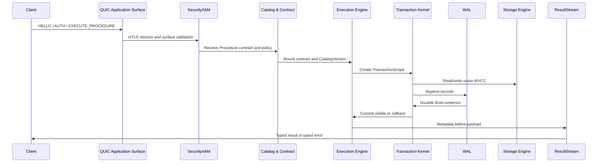

# Engine overview

> **Status:** Architecture overview  
> **Audience:** Andromeda maintainers, engine developers, architects, reviewers  
> **Language:** American English  
> **Baseline:** Rust 1.95.0, Rust 2024 Edition, x64 and ARM64 first

## In this article


- Understand the top-level Andromeda architecture.
- Identify core engines and cross-cutting planes.
- Preserve the procedure-only, contract-first execution path.

## Architecture summary

Andromeda is composed of engines and planes. Engines own functional responsibility. Planes enforce cross-cutting policy.

```text
Application client
-> QUIC Application Surface
-> typed RPC
-> security admission
-> contract binding
-> Procedure execution
-> Transaction Kernel
-> WAL
-> Storage Engine
-> ResultStream
```

## Main engines

| Engine | Responsibility |
|---|---|
| Core Engine | IDs, clocks, accounting, feature profiles, low-level primitives. |
| Catalog & Contract Engine | Object definitions, versions, Procedure contracts, compatibility. |
| SRPL Compiler | Parse, bind, validate, lower into semantic IR. |
| Execution Engine | Admission orchestration, Procedure dispatch, ResultStream construction. |
| Transaction Kernel | Transaction state, isolation, commit, rollback, MVCC visibility. |
| Storage Engine | WAL, pages, buffer pool, HotStore, ColdStore, manifests, recovery. |
| Network Surface Layer | QUIC surfaces and stream lifecycle. |
| Security/IAM Plane | mTLS identity, principals, roles, permissions, policies, audit. |
| Optimizer & Statistics Engine | StatsVersion, histograms, cost model, plan classes. |
| Procedure Store | Runtime invocation evidence and plan feedback. |
| Analytics & Hardware Engine | Columnar Maps, SIMD, GPU batch, NVMe/HDD policies. |
| Operations Engine | Backup, restore, HA/DR, PITR, forensic, maintenance. |

## Cross-cutting planes

| Plane | Enforces |
|---|---|
| Durability Plane | WAL, flush, checkpoint, snapshot, manifest, recovery. |
| Security Plane | Authentication, authorization, surface scopes, audit. |
| Contract Plane | Procedure shape, permissions, compatibility, protocol layout. |
| Policy Plane | Versioned security, storage, resource, transaction, audit, recovery policy. |
| Resource Governance Plane | CPU, RAM, NVMe, GPU, temp, spill, network quotas. |
| Observability Plane | Traces, metrics, RecoveryReport, DecisionTrace, audit evidence. |
| Testing and Evidence Plane | Unit, property, fuzz, Miri, crash, recovery, HA/DR, benchmarks. |

## Canonical invocation flow



## Forbidden shortcuts

```text
Application Surface -> Administration operation
Procedure -> external network
Procedure -> external filesystem
GPU runtime -> commit protocol
Procedure Store -> forced plan without optimizer policy
Predictive evidence -> sole decision-maker
Replica -> self-promotion without quorum
Certificate -> permission bypass
```
