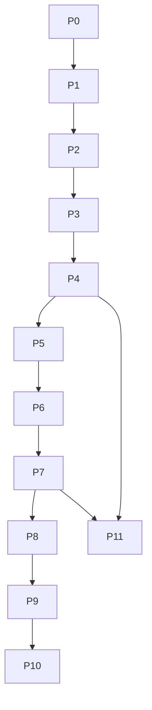

# Andromeda technical roadmap

> **Status:** Sequenced technical roadmap  
> **Scope:** Documentation and implementation guidance  
> **Rule:** Sequence-only roadmap

## In this article

- Understand the roadmap sequence.
- Use entry and exit criteria instead of calendar promises.
- Keep the project focused on durable Procedure execution first.

## Roadmap doctrine

The roadmap is ordered by dependency and proof value. It intentionally uses sequence language only.

```text
Truth and recovery
-> Catalog and contracts
-> SRPL and transaction-scoped execution
-> Secure RPC
-> Statistics and optimizer
-> Maps and analytics
-> Optional GPU acceleration
-> HA/DR and production operations
```

## Phase map

| Phase | Name | Purpose | Detailed file |
|---|---|---|---|
| P0 | Specification baseline | Produce normative minimal specs before increasing feature breadth. | `P0_SPECIFICATION_BASELINE.md` |
| P1 | Durable vertical path | Prove Procedure to WAL to Recovery to ResultStream. | `P1_DURABLE_VERTICAL_PATH.md` |
| P2 | Catalog and DefinitionBatch durability | Make catalog publication durable, versioned, and recoverable. | `P2_CATALOG_DEFINITION_BATCH.md` |
| P3 | Generic Procedure execution | Replace hard-coded procedure paths with catalog-backed dispatch. | `P3_GENERIC_PROCEDURE_EXECUTION.md` |
| P4 | Storage V0 completion | Complete storage primitives for pages, manifests, SegmentIndex, checkpoints, and cold snapshots. | `P4_STORAGE_V0_COMPLETION.md` |
| P5 | Transaction and MVCC strengthening | Strengthen isolation, MVCC versions, rollback, and GC pins. | `P5_TRANSACTION_MVCC_STRENGTHENING.md` |
| P6 | QUIC application runtime | Enable feature-gated QUIC application runtime after admission gates are stable. | `P6_QUIC_APPLICATION_RUNTIME.md` |
| P7 | IAM and audit durability | Persist security principals, certificates, permissions, policies, and audit evidence. | `P7_IAM_AUDIT_DURABILITY.md` |
| P8 | Statistics and optimizer V0 | Introduce CPU statistics, bounded cost model, PlanCacheKey, and DecisionTrace. | `P8_STATISTICS_OPTIMIZER_V0.md` |
| P9 | Maps and analytics before GPU | Build Maps and analytics semantics before optional GPU acceleration. | `P9_MAPS_ANALYTICS_BEFORE_GPU.md` |
| P10 | Optional GPU acceleration | Add optional GPU batch acceleration only after CPU analytics and stats are stable. | `P10_OPTIONAL_GPU_ACCELERATION.md` |
| P11 | HA/DR, backup, PITR, and forensic drills | Complete production-oriented resilience workflows. | `P11_HADR_BACKUP_PITR_FORENSIC.md` |


## Dependency graph



## Current priority

The next useful work is not adding breadth. The priority is to prove the durable vertical path:

```text
Procedure
-> Catalog
-> SRPL IR
-> Admission
-> Transaction
-> WAL
-> Heap/Page
-> Recovery
-> ResultStream
```

## Roadmap anti-patterns

- Adding GPU before durable WAL and recovery are proven.
- Adding learned optimizer behavior before stable StatsVersion and DecisionTrace.
- Adding HA/DR promotion before fencing and backup restore drills.
- Adding broad SRPL syntax before binder, cardinality, and contract checks.
- Adding application-surface SQL as a shortcut.

## Completion rule

A phase is complete only when exit criteria and acceptance checks are satisfied. A phase is not complete because code exists.
