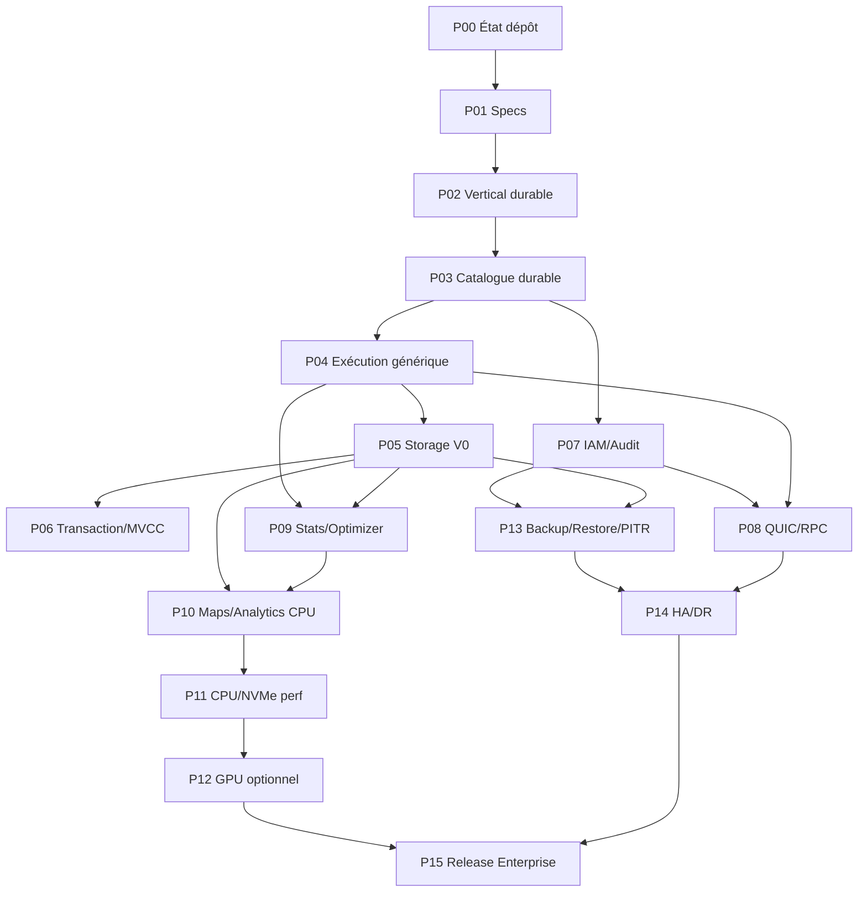

# Roadmap complète Andromeda 2026

## Position d’exécution

Cette roadmap vise à faire passer Andromeda d’un prototype vertical récupérable et très documenté à une base SGBDRT Enterprise Grade testable, durable, observable et extensible. Elle est volontairement séquencée par dépendances, pas par calendrier.

## Ordre stratégique

```text
État réel et gouvernance
-> Specs normatives
-> Vertical durable
-> Catalogue durable
-> Exécution générique
-> Storage complet
-> Transaction/MVCC
-> Sécurité/IAM/Audit
-> QUIC/RPC runtime
-> Stats/Optimizer
-> Maps/Analytics CPU
-> Performance CPU/NVMe
-> GPU optionnel
-> Backup/Restore/PITR
-> HA/DR
-> Release hardening
```

## Invariants globaux

- Aucune surface applicative SQL ad hoc.
- Toute exécution applicative passe par une Procedure cataloguée.
- Toute Procedure possède un contrat typé, hashé, versionné et vérifiable.
- Toute Procedure est transaction-scoped.
- Aucun commit visible sans WAL durable.
- La RAM, le BufferPool, les traces, les benchmarks, le GPU et les sorties analytiques ne sont jamais vérité système.
- La vérité reconstruite est le dernier snapshot froid valide plus le WAL durable requis depuis ce snapshot.
- Le GPU reste hors commit, rollback, WAL, recovery, MVCC short visibility et sécurité critique.
- Predictive Evidence et ScenarioEvidence proposent, mais ne décident jamais seuls.
- Les plans actifs sont liés à CatalogVersion, StatsVersion, PolicyVersion, ContractHash et PlanClass.
- Toute décision critique doit être observable, explicable et reliée à une trace stable.

## Phases

| Phase | Nom | But | Fichier |
| --- | --- | --- | --- |
| P00 | État dépôt, baseline Rust et gouvernance des preuves | Stabiliser la lecture du dépôt main, figer la baseline Rust 1.95.0, corriger les incohérences documentaires et créer les règles de preuve communes. | phases/P00_REPOSITORY_STATE_AND_GOVERNANCE.md |
| P01 | Spécifications normatives minimales | Transformer la doctrine en specs courtes, testables et refusables avant d’augmenter le périmètre fonctionnel. | phases/P01_NORMATIVE_SPECIFICATION_BASELINE.md |
| P02 | Vertical durable Inventory.ProductStock | Prouver le chemin Procedure -> Admission -> Transaction -> WAL -> Heap/Page -> Recovery -> ResultStream sur un cas métier minimal. | phases/P02_DURABLE_VERTICAL_PATH_PRODUCT_STOCK.md |
| P03 | Catalogue, ContractHash et DefinitionBatch durable | Rendre le catalogue réellement durable, transactionnel, versionné et récupérable, avec DefinitionBatch comme seule voie de mutation contrôlée. | phases/P03_CATALOG_DEFINITION_BATCH_DURABILITY.md |
| P04 | Exécution générique de Procedures cataloguées | Remplacer les chemins hard-codés par un dispatch ProcedureId + ContractHash + CatalogVersion + payload shape. | phases/P04_GENERIC_PROCEDURE_EXECUTION.md |
| P05 | Storage V0 : pages, WAL, manifests et SegmentIndex | Achever les primitives de stockage nécessaires au démarrage rapide, au replay et à la publication cold/hot cohérente. | phases/P05_STORAGE_WAL_PAGE_MANIFEST_COMPLETION.md |
| P06 | Transaction, MVCC, isolation et rollback | Durcir la machine d’état transactionnelle, la visibilité MVCC, les conflits et les garanties d’isolation. | phases/P06_TRANSACTION_MVCC_ISOLATION_STRENGTHENING.md |
| P07 | IAM, sécurité et audit durable | Persister les identités, certificats, policies et audit evidence sans créer de bypass applicatif. | phases/P07_SECURITY_IAM_AUDIT_DURABILITY.md |
| P08 | QUIC/RPC runtime applicatif | Activer un runtime QUIC applicatif feature-gated après stabilisation admission, frames et Procedure dispatch. | phases/P08_QUIC_RPC_APPLICATION_RUNTIME.md |
| P09 | Statistics, Procedure Store et optimizer V0 | Introduire des statistiques versionnées, un coût V0 explicable et un optimizer borné sans composants learned autoritaires. | phases/P09_STATISTICS_OPTIMIZER_PROCEDURE_STORE_V0.md |
| P10 | Maps, analytique CPU et columnar avant GPU | Construire les Maps matérialisées, le grain analytique et les layouts columnar CPU avant toute accélération GPU. | phases/P10_MAPS_ANALYTICS_CPU_FIRST.md |
| P11 | Performance CPU/NVMe et gouvernance ressources | Optimiser seulement après preuve fonctionnelle, avec métriques, profils hardware, fallback et policies. | phases/P11_CPU_NVME_PERFORMANCE_AND_RESOURCE_GOVERNANCE.md |
| P12 | GPU batch optionnel | Ajouter GPU_STATS/GPU_ANALYTICS/GPU_BENCHMARK seulement comme accélération batch optionnelle, jamais C5. | phases/P12_OPTIONAL_GPU_BATCH_ACCELERATION.md |
| P13 | Backup, restore, PITR et forensic | Rendre backup et restore prouvables par artefacts, WAL archives, manifests et drills de restauration. | phases/P13_BACKUP_RESTORE_PITR_FORENSIC.md |
| P14 | HA/DR Single Primary, quorum et fencing | Mettre en place HA/DR V0 single-primary avec WAL shipping, quorum, fencing et promotion prouvée. | phases/P14_HADR_SINGLE_PRIMARY_CLUSTER.md |
| P15 | Durcissement Enterprise Grade et release gates | Transformer le prototype recoverable en candidat de release interne avec preuves retenues, runbooks, supply chain et validation exhaustive. | phases/P15_ENTERPRISE_RELEASE_HARDENING.md |

## Graphe de dépendances



## Méthode de travail pyramidale

1. Les personnes 1 et 2 verrouillent gouvernance, CI, boundaries et preuves.
2. Les personnes 3 à 14 construisent le socle C5 : catalog, SRPL, execution, WAL, storage, recovery, transaction, security, audit, RPC.
3. Les personnes 15 à 19 n’entrent en décision qu’après la vérité durable : optimizer, stats, maps, CPU/NVMe, GPU.
4. La personne 20 orchestre backup, restore, HA/DR, release gates et runbooks avec les owners C5.
5. Tout travail adaptatif doit rester versionné, observable, borné, explicable et désactivable.

## Règle d’acceptation globale

Une phase est terminée lorsque ses critères de sortie sont passés par test ou evidence retenue. Le fait qu’un crate existe ou qu’une spec existe ne suffit pas.

## Validation globale recommandée

```powershell
cargo fmt --all -- --check
cargo check --workspace --locked
cargo test --workspace --locked
cargo clippy --workspace --all-targets --locked -- -D warnings
```

Puis, selon les phases : crash runner, property tests, fuzz, Miri, restore drills, HA/DR negative tests et release evidence bundle.
